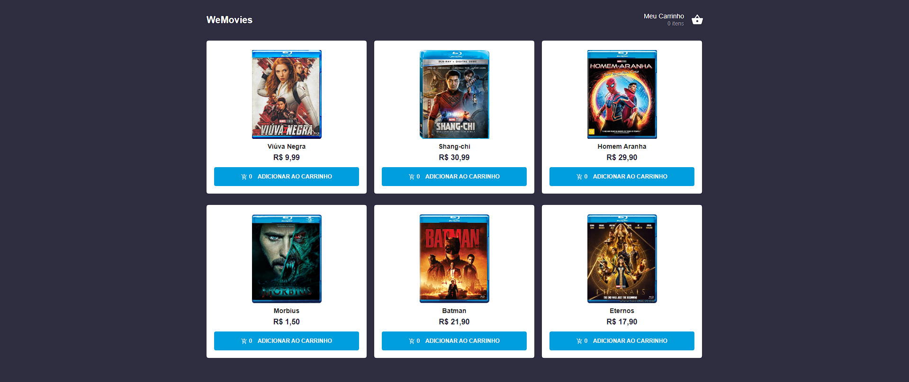

# Wemovies
Projeto de e-commerce, voltado para mídias digitais, consume uma [API](https://wefit-movies.vercel.app/api/movies) para listagem dos produtos.



O projeto utilizou do "useContext" do próprio React para salvar os produtos no carrinho e gerenciar os estados de maneira global. Além disso os produtos adicionados ao carrinho são salvos no armazenamento local do navegador, para que possam ficar salvos no dispositivo mesmo que o usuário feche o site.

Por fim para rodar o projeto você precisa acessar o terminal, se direcionar ao repositório deste projeto e executar os seguintes comandos:

```bash

    npm i
    npm run build
    npm start

```